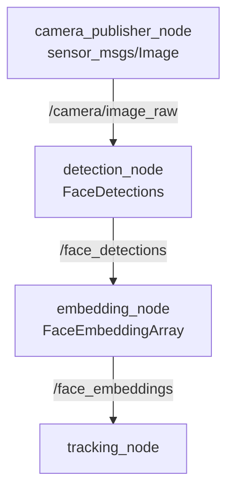

# YOLO-face-recognition


## Overview
This repository implements a modular ROS2 face detection, recognition, and tracking pipeline designed for real-time perception systems.
The system:
- detects faces from live stream camera
- It computes the corresponding embeddings over the detected faces
- Matches the detected faces with known identities
- Tracks identities consistently across frames
This pipeline shows a clear separation of concerns allowing individual components (detector, embedder, tracker) to be replaced or improved independently.
## System Architecture
This pipeline consists of 4 main ROS2 nodes:
Camera -> Face detection -> Face embedding -> Face tracking


Each node performs a well defined task which provides robustness and scalability.
## Node Descriptions
1) Camera publisher node:
   - Responsibility : publishes RGB frames from a camera
   - Publishes : /camera/image_raw (sensor_msgs/Image) (publishes on topic /camera/image_raw , messages of type Image)
   - Source camera provided in the node can be replaced with any other ROS2 compatible camera, ensuring in this way hardware flexibility

2) Detection node:
   Model used for face detection : YOLOv12n (face-specific variant)
   Responsibility of this nodeL:
   - Receives camera frames
   - Performs face detection
   - Outputs bounding boxes for detected faces

   Subscribes to : /camera/image_raw
   Publishes on : /face_detections (face_msgs/FaceDetections)
   Bounding boxes are encoded using vision_msgs/Detection2D.

3) Embedding node:
   Model used for embedding : InceptionResnetV1 (pretrained on VGGFace2)
   Responsibility :
   - It crops the detected faces
   - It computes normalized face embeddings
   - It assigns these embeddings to detections

  Subscribes : /camera/image_raw
  Publishes on : /face_embeddings (face_msgs/FaceEmbeddingArray)

4) Tracking node:
   - It associates detections with the tracks in the frames (every detection is linked with the track it resembles the most)
   - Embeddings of face detections are compared with known embedded identities
   - Identities are confirmed using temporal consistency
   - Faces are tracked using IoU + embedding similarity

   Subscribes to : /face_embeddings
   ### Key features:
   - Sliding window used for identity confirmation (using a running mean and standard deviation)
   - lifecycle management of tracks (creation, confirmation, deletion)
   
## Topics and Message Flow
| Topic               | Message Type                   | Description                         |
| ------------------- | ------------------------------ | ------------------------------------|
| `/camera/image_raw` | `sensor_msgs/Image`            | Raw RGB camera frames               |
| `/face_detections`  | `face_msgs/FaceDetections`     | Face bounding boxes + image         |
| `/face_embeddings`  | `face_msgs/FaceEmbeddingArray` | Bounding boxes + embeddings + image |

## Installation
First, ROS2 needs to be installled from https://docs.ros.org/en/humble/Installation.html (or any other ROS2 distribution compatible with the operating system it is deployed) 
Commands to follow in a terminal:
```
git clone <this_repository>
cd ros2_yolo_ws
source /opt/ros/<ROS_DISTRO>/setup.bash
colcon build
source install/setup.bash
ros2 run yolo_face_recognition camera_node
```
In order to have the pipeline up and working, every node needs to be run in a different terminal. In the other terminal, you just need to run:

```
# navigate to ros2_yolo_ws
cd ros2_yolo_ws
source /opt/ros/<ROS_DISTRO>/setup.bash
colcon build
source install/setup.bash
ros2 run yolo_face_recognition <nodes>
```
where "nodes" are to be replaced in this order : detection_node, embedding_node, tracking_node (each node is run in a new terminal)

## Configuration
Known identities are stored in config/faces.yaml. Example of how the file looks like:
```
me:
  - 0.0123
  - -0.9981
  - ...
```
Each identity is stored under a face embedding vector of 512 dimensions.

Embeddings must be:
- FLoatt32
- Normalized
- Generated using the same embedding model

## Face Identity Management and Tracking Logic

The tracking module is responsible for maintaining **persistent identity hypotheses** across consecutive frames and validating them against known reference identities.

Each **track** represents a hypothesis that a sequence of detections corresponds to the **same physical individual** over time (e.g., *“Is this person Paul?”*). Tracks are updated incrementally as new frames arrive and are confirmed or discarded based on temporal consistency.

---

### Track Association

For each incoming frame, detected faces are matched against existing tracks using a **two-stage gating strategy**:

1. **Spatial consistency**  
   Bounding box overlap is evaluated using **Intersection-over-Union (IoU)** to ensure spatial continuity.

2. **Appearance similarity**  
   **Cosine similarity** between the detection embedding and the track’s current embedding is used to validate appearance consistency.

Each detection can update **at most one track per frame**, preventing conflicting assignments and enforcing physical plausibility.

---

### Track State Update

When a detection is associated with an existing track, the following updates occur:

- **Spatial state**
  - `last_detection`: most recent bounding box
  - `last_seen_frame`: index of the last frame in which the track was observed

- **Appearance model update**
  - The track embedding is updated using an **Exponential moving average (EMA)**:
    - This reduces embedding noise while allowing gradual adaptation to pose, illumination, and expression changes.

- **Identity evidence accumulation**
  - The similarity between the track embedding and the reference embedding is added to a sliding temporal window.
  - Statistical consistency (mean and variance) over this window is used for identity confirmation.

---

### Track Initialization

If a detected face cannot be associated with any existing track:

- A new track is initialized using the detection embedding as its initial appearance model.
- The most similar reference embedding (above a configurable similarity threshold) is assigned as a **candidate identity**.
- The track enters a **TENTATIVE** state until sufficient temporal evidence is collected.

---

### Identity Confirmation

A track transitions from **TENTATIVE** to **CONFIRMED** when:

- The mean similarity to the reference embedding exceeds a predefined threshold.
- The variance within the temporal window remains below a stability threshold.

This approach ensures that identity confirmation is **robust and temporally stable**, reducing false positives caused by transient or noisy detections.

---

### Track Lifecycle Management

Tracks are automatically removed if they are not updated for a configurable number of frames (default: 5).  
This prevents stale hypotheses from persisting when a person leaves the scene or becomes fully occluded.

---

### Design Rationale

This tracking design provides:

- Temporal stability in identity assignment  
- Robustness to short-term occlusions  
- Noise-resilient embedding updates  
- Online, real-time operation suitable for ROS 2 pipelines  

## Tracking Logic (high level)
- Face detections are assigned to existing tracks based on IoU(how much do the bounding boxes overlap?) and cosine similarity
- Track embeddings are updated using exponential moving average for the removal of embedding noise and gradual adaptation
- Identity confirmation requires mean and variance of sliding window to fall certain thresholds (high mean and low variance).
## Performance Considerations
- The main factor causing latency if YOLO inference
- Embedding computation runs on GPU when available
- This pipeline can be deployed in multiple systems.
## Limitations
- No re-identification after long occlusions
- Single-camera only
- Identity database must be pre-generated

## Extending the System
- Integrate a database backend (used for retrieving identities we want to track)
- Enable multi-camera support
- Experiments with multiple YOLO-face models

## License
Apache 2.0
